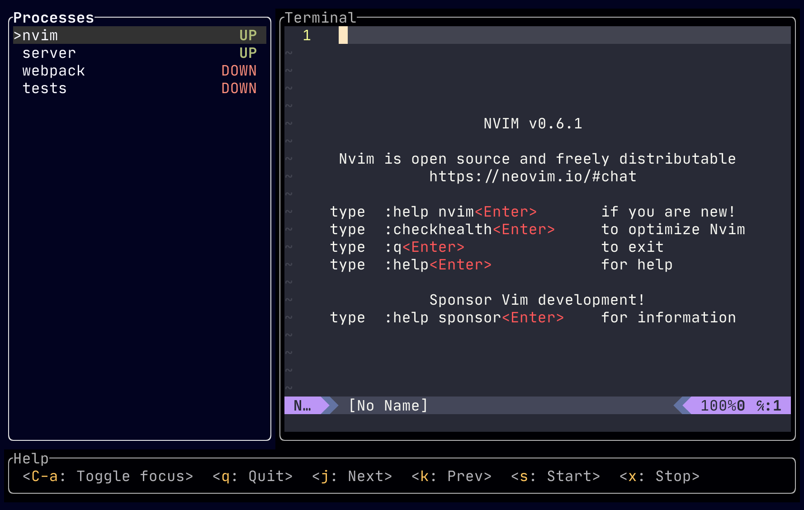
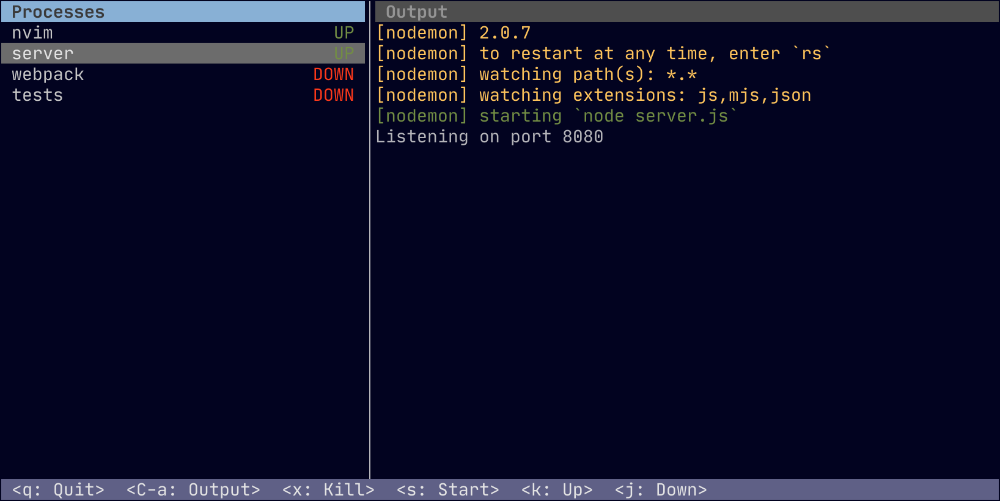

# mprocs

mprocs runs multiple commands in parallel and shows output of each command
separately.

## Screenshots




## Installation

[Download](https://github.com/pvolok/mprocs/releases) executable for your
platform and put it into a directory included in PATH.

## Usage

1. Create `mprocs.json` file
2. Run `mprocs` command

Example `mprocs.json`:

```json
{
  "procs": {
    "nvim": {
      "cmd": ["nvim"]
    },
    "server": {
      "shell": "nodemon server.js"
    },
    "webpack": {
      "shell": "webpack serve"
    },
    "tests": {
      "shell": "jest -w",
      "env": {
        "NODE_ENV": "test"
      }
    }
  }
}
```

### Config

- **procs**: _object_ - Processes to run.
  - **shell**: _string_ - Shell command to run (only **shell** or **cmd** must
    be provided).
  - **cmd**: _array<string>_ - Array of command and args to run (only **shell**
    or **cmd** must be provided).
  - **env**: _object<string, string|null>_ - Set env variables. Object keys are
    variable names. Assign variable to null, to clear variables inherited from
    parent process.

### Key bindings

Process list focused:

- `q` - Quit (soft kill processes and wait then to exit)
- `Q` - Force quit (terminate processes)
- `C-a` - Focus output pane
- `x` - Soft kill selected process (send SIGTERM signal, hard kill on Windows)
- `X` - Hard kill selected process (send SIGKILL)
- `s` - Start selected process, if it is not running
- `k` - Select previous process
- `j` - Select next process
- `C-d` - Scroll output down
- `C-u` - Scroll output up

Process output focused:

- `C-a` - Focus processes pane
